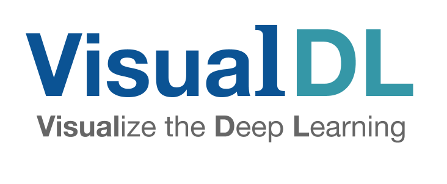

<p align="center">
  
</p>

## Introduction
VisualDL is a deep learning visualization tool that can help design deep learning jobs.
It includes features such as scalar, parameter distribution, model structure and image visualization.
Currently it is being developed at a high pace.
New features will be continuously added.

At present, most DNN frameworks use Python as their primary language. VisualDL supports Python by nature.
Users can get plentiful visualization results by simply add a few lines of Python code into their model before training.


Besides Python SDK, VisualDL was writen in C++ on the low level. It also provides C++ SDK that
can be integrated into other platforms.  


## Component
VisualDL now provides 4 components:

- graph
- scalar
- image
- histogram

### Graph
Graph is compatible with ONNX(Open Neural Network Exchange)[https://github.com/onnx/onnx],
Cooperated with Python SDK, VisualDL can be compatible with most major DNN frameworks, including
PaddlePaddle, PyTorch and MXNet.

<p align="center">
  
</p>

### Scalar
Scalar can be used to show the trends of error during training.


<p align="center">

</p>

### Image
Image can be used to visualize any tensor or intermediate generated image.

<p align="center">

</p>

### Histogram
Histogram can be used to visualize parameter distribution and trends for any tensor.

<p align="center">

</p>

## Quick Start
```
# install
pip install --upgrade visualdl

# run a demo
vdl_scratch.py
visualDL --logdir=scratch_log --port=8080

# visit http://127.0.0.1:8080
```

## SDK
VisualDL provides both Python SDK and C++ SDK in order to fit more use cases.


### Python SDK
Below is an example of creating a simple Scalar component and inserting data from different timestamps:

```python
import random
from visualdl import LogWriter

logdir = "./tmp"
logger = LogWriter(dir, sync_cycle=10)

# mark the components with 'train' label.
with logger.mode("train"):
    # create a scalar component called 'scalars/scalar0'
    scalar0 = logger.scalar("scalars/scalar0")

# add some records during DL model running.
for step in range(100):
    scalar0.add_record(step, random.random())
```

### C++ SDK
Here is the C++ SDK identical to the Python SDK example above:

```c++
#include <cstdlib>
#include <string>
#include "visualdl/sdk.h"

namespace vs = visualdl;
namepsace cp = visualdl::components;

int main() {
  const std::string dir = "./tmp";
  vs::LogWriter logger(dir, 10);

  logger.SetMode("train");
  auto tablet = logger.NewTablet("scalars/scalar0");

  cp::Scalar<float> scalar0(tablet);

  for (int step = 0; step < 1000; step++) {
    float v = (float)std::rand() / RAND_MAX;
    scalar0.AddRecord(step, v);
  }

  return 0;
}
```

## Launch Board
After some logs have been generated during training, users can launch board to see real-time data visualization.


```
visualDL --logdir <some log dir>
```

Board also supports the parameters below for remote access:

- `--host` set IP
- `--port` set port
- `--model_pb` specify ONNX format for model file

### How to install from pypi
```
pip install --upgrade visualdl
```

### How to build and install locally
```
git clone https://github.com/PaddlePaddle/VisualDL.git
cd VisualDL

python setup.py bdist_wheel
pip install --upgrade dist/visualdl-*.whl
```

### Run a demo from scratch
```
vdl_scratch.py
visualDL --logdir=scratch_log --port=8080
```
that will start a server locally on port 8080, then
you can visit http://127.0.0.1:8080 the see the visualdl board.


### Contribute

VisualDL is initially created by [PaddlePaddle](http://www.paddlepaddle.org/) and
[ECharts](http://echarts.baidu.com/).
We welcome everyone to use, comment and contribute to Visual DL :)
