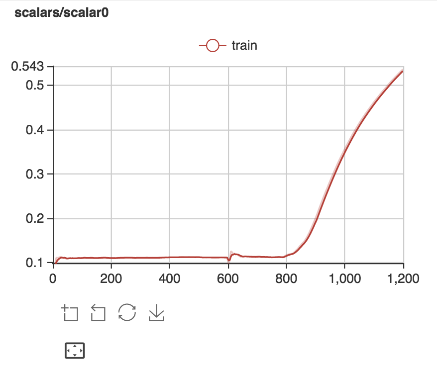

# 在MXNet中使用VisualDL

下面我们演示一下如何在MXNet中使用VisualDL，从而可以把MXNet的训练过程以及最后的模型可视化出来。我们将以MXNet用卷积神经网络(CNN, Convolutional Neural Network)来训练[MNIST](http://yann.lecun.com/exdb/mnist/)数据集作为例子。

- [安装MXNet](#install-mxnet)
- [安装VisualDL](#安装VisualDL)
- [开始编写训练MNIST的程序](#开始编写训练MNIST的程序)

## 安装MXNet {#install-mxnet}
请按照MXNet的[官方网站](https://mxnet.incubator.apache.org/get_started/install.html)来安装MXNet，并验证安装成功。


    >>> import mxnet as mx
    >>> a = mx.nd.ones((2, 3))
    >>> b = a * 2 + 1
    >>> b.asnumpy()
    array([[ 3.,  3.,  3.],
           [ 3.,  3.,  3.]], dtype=float32)

## 安装VisualDL {#mht}
VisualDL的安装很简单。请按照VisualDL的[官方网站](https://github.com/PaddlePaddle/VisualDL)进行安装。具体只需要两步

```
python setup.py bdist_wheel
pip install --upgrade dist/visualdl-0.0.1-py2-none-any.whl
```

## 开始编写训练MNIST的程序

我们为您提供了一个演示程序 [mxnet_demo.py](./mxnet_demo.py)。里面展示了如何下载MNIST数据集以及编写MXNet程序来进行CNN的训练。MXNet的部分借鉴了MXNet[官方入门文件](https://mxnet.incubator.apache.org/tutorials/python/mnist.html)
为了嵌入VisualDL程序，以便在MXNet训练时进行检测，我们需要声明一个logger实例：

```
logger = LogWriter(logdir, sync_cycle=10)
```

logger实例里面包含VisualDL的四个功能模块 Scalar， Image， Graph 以及 Histogram。这里我们使用 Scalar 模块：

```
scalar0 = logger.scalar("scalars/scalar0")
```

模块的命名可以有 '/', 以便对于复杂模型创建不同的命名空间。

MXNet在fit函数中提供了很多[API](https://mxnet.incubator.apache.org/api/python/index.html)。我们把自己编写好的回调函数 add_scalar 插入到相应的 API中

```
lenet_model.fit(train_iter,
                eval_data=val_iter,
                optimizer='sgd',
                optimizer_params={'learning_rate':0.1},
                eval_metric='acc',
                # 在此嵌入我们自定义的回调函数
                batch_end_callback=[add_scalar()],
                num_epoch=2)
```

这样就好了。在MXNet的训练过程中，每一个批次（batch）训练完后，都会调用我们的回调函数来对准确率进行记录。如您所料，随着训练的进行，准确率会不断上升直到95%以上。以下是两个epoch训练过后的准确率走向：

<p align=center></p>
