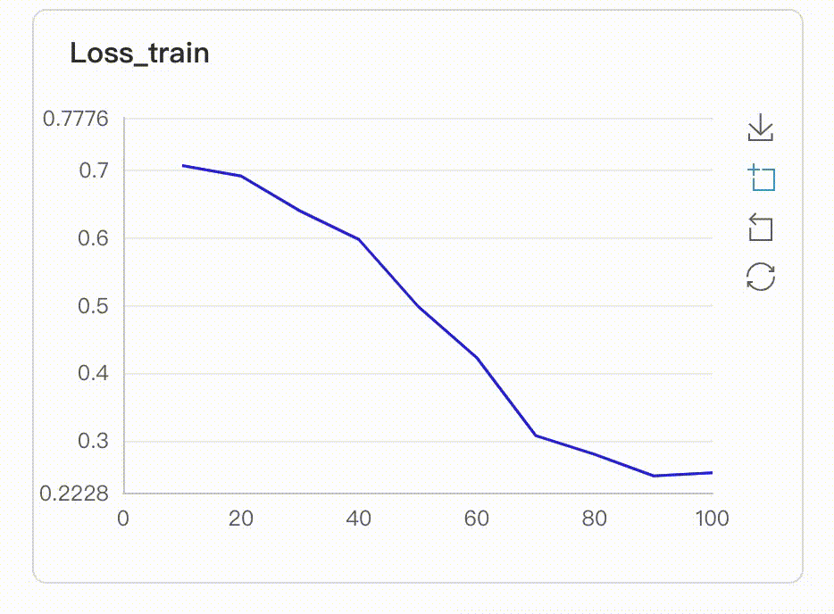
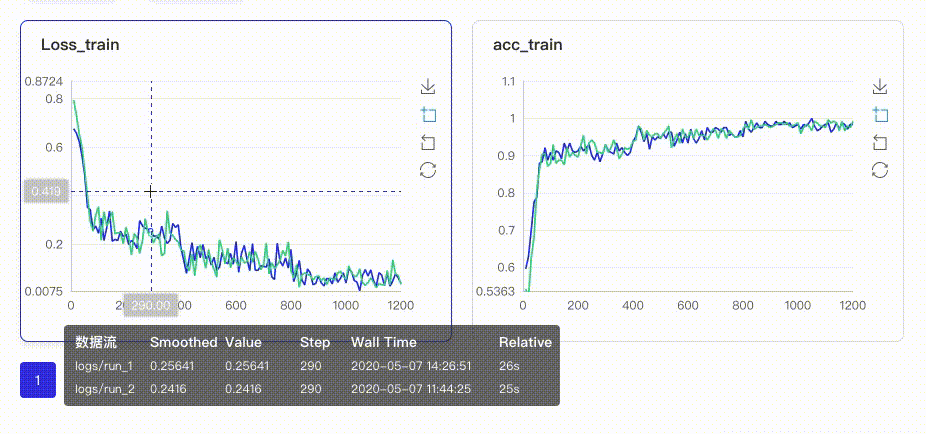
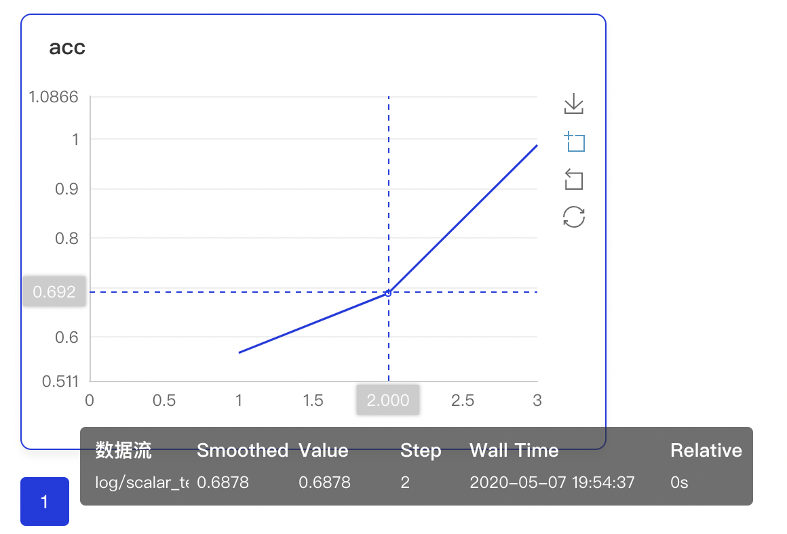

<p align="center">
  
</p>

## 介绍
VisualDL是一个面向深度学习任务设计的可视化工具，利用丰富的图表展示数据，用户可以更直观、清晰地查看数据的特征与变化趋势，有助于分析数据、及时发现错误，进而改进神经网络模型的设计。

目前大多数DNN平台均使用Python作为配置语言，VisualDL原生支持python的使用，
通过在模型的Python配置中添加几行，便可以为训练过程提供丰富的可视化支持。

VisualDL拥有不同种类的组件，能够帮助开发者有效记录和监测训练中的各种指标和数据，为模型训练数据参考，及时发现错误，进而改进神经网络模型的设计，关于组件的具体信息可以参考[VisualDL组件](./components/README.md)。

## 特点
### 1 动态展示
在启动VisualDL Board后，LogReader将不断增量的读取日志中数据并供前端调用展示，因此能够在训练中同步观测指标变化，如下图：

<p align="center">
  
</p>

### 2 多实验对比
VisualDL支持多实验对比，只需要在启动VisualDL Board的时候将每个实验日志所在路径同时传入即可，每个实验中相同tag的指标将绘制在一张图中同步呈现，如下图：

<p align="center">
  
</p>

## 安装
建议在anaconda环境下进行安装，便于开发环境的隔离，pip安装命令为：
```shell
python -m pip install visualdl
```
需要注意，由于官方不再维护Python2，因此VisualDL在v2.0.0之后的版本仅支持Python3

## 使用
### 记录日志
VisualDL的后端提供了Python SDK，可通过LogWriter定制一个日志记录器，接口如下：
```python
class LogWriter(
                logdir=None,
                comment='',
                max_queue=10,
                flush_secs=120,
                filename_suffix='',
                write_to_disk=True,
                **kwargs
                )
```
接口参数说明如下：
|参数|格式|含义|
|-|-|-|
|logdir|string|日志文件所在的路径，VisualDL将在此路径下建立日志文件并进行记录，如果不填则默认为`runs/${CURRENT_TIME}`|
|comment|string|为日志文件夹名添加后缀，如果制定了logdir则此项无效|
|max_queue|int|日志记录消息队列的最大容量，达到此容量则立即写入到日志文件|
|flush_secs|int|日志记录消息队列的最大缓存时间，达到此时间则立即写入到日志文件|
|filename_suffix|string|为默认的日志文件名添加后缀|
|write_to_disk|boolean|是否写入到磁盘|

初始化并记录标量数据到日志文件的过程如下：
```python
from visualdl import LogWriter

# 在`./log/scalar_test/train`路径下建立日志文件
with LogWriter(logdir="./log/scalar_test/train") as writer:
    # 使用scalar组件记录一个标量数据
    writer.add_scalar(tag="acc", step=1, value=0.5678)
    writer.add_scalar(tag="acc", step=2, value=0.6878)
    writer.add_scalar(tag="acc", step=3, value=0.9878)
```
关于LogWriter组件的更多具体用法，请参考[VisualDL组件](./components/README.md)


### 启动面板
我们已经记录了三个标量数据到日志中，现在可以启动VisualDL面板查看日志的可视化结果，启动方式分为两种：
#### 在命令行启动
我们可以使用命令行启动VisualDL面板，命令格式为：
```shell
visualdl --logdir <dir_1, dir_2, ... , dir_n> --host <host> --port <port>
```
参数意义分别为：
- `--logdir` 设定日志所在目录，可以指定多个目录，VisualDL将遍历并且迭代寻找指定目录的子目录，将所有实验结果进行可视化
- `--host` 设定IP，默认为`127.0.0.1`
- `--port` 设定端口，默认为`8040`

针对上一步生成的日志，我们的启动命令为
```shell
visualdl --logdir ./log
```

#### 在Python脚本中启动
我们还可以在Python脚本中启动VisualDL面板，接口如下：

```python
visualdl.server.app.run(logdir,
                        host="127.0.0.1",
                        port=8080,
                        cache_timeout=20,
                        language=None,
                        open_browser=False)
```
接口参数说明如下：
|参数|格式|含义|
|-|-|-|
|logdir|string或list[string_1, string_2, ... , string_n]|日志文件所在的路径，VisualDL将在此路径下递归搜索日志文件并进行可视化，可指定单个或多个路径|
|host|string|指定启动服务的ip，默认为`127.0.0.1`|
|port|int|启动服务端口，默认为`8040`|
|cache_timeout|int|后端缓存时间，在缓存时间内前端多次请求同一url，返回的数据从缓存中获取，默认为20秒|
|language|string|VisualDL面板语言，可指定为'EN'或'CN'，默认自动匹配操作系统使用语言|
|open_browser|boolean|是否打开浏览器，设置为True则在启动后自动打开浏览器并访问VisualDL面板|

针对上一步生成的日志，我们的启动脚本为：
```python
from visualdl.server import app

app.run(logdir="./log")
```

在使用任意一种方式启动VisualDL面板后，我们可以打开浏览器访问VisualDL面板，在面板上就可以看到日志的可视化结果，如图：
<p align="center">
  
</p>
