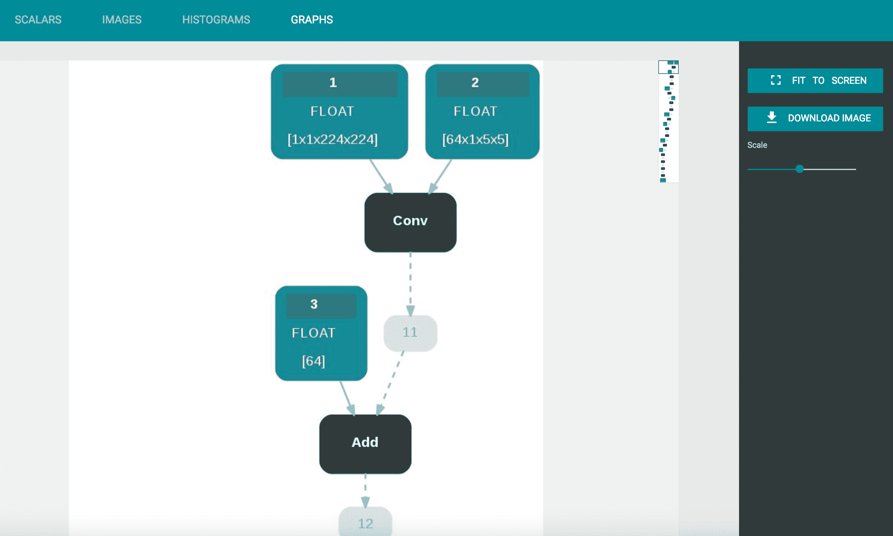
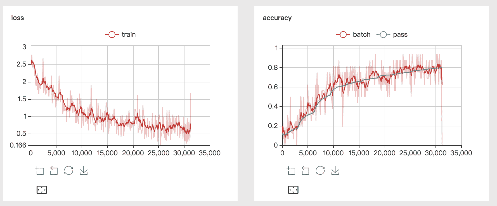
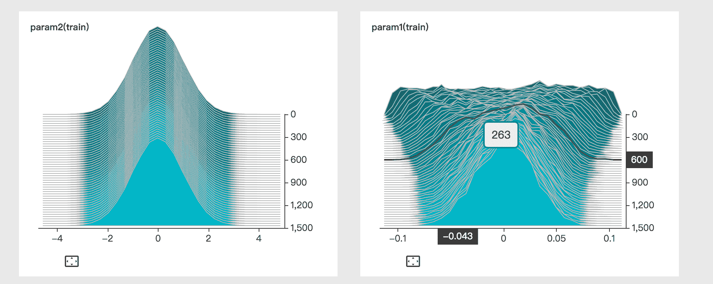

# VisualDL (Visualize the Deep Learning)

## Introduction

VisualDL is a visualization tool for deep learning, including scalar, parameter distribution, model structure, image visualization and other features.
The project is under development, and will provide more features.

Most of the DNN platforms are using Python. VisualDL supports Python out of the box.
By just adding a few lines of configuration to the code, VisualDL can provide a rich visual support for the training process.

In addition to Python SDK, the underlying VisualDL is written in C++, and its exposed C++ SDK can be integrated into other platforms.
Users can access the original features and monitor customized matrix. 

## Components
VisualDL supports four componments：

- graph
- scalar
- image
- histogram

### graph
Compatible with ONNX (Open Neural Network Exchange) [https://github.com/onnx/onnx]. VisualDL is compatible with the mainstream DNN platforms such as PaddlePaddle, Pytorch, and MXNet through Python SDK.

<p align="center">

</p>

### scalar
Show the error trend throughout the training. 

<p align="center">

</p>

### image
To visualize any tensor, or model generated images

<p align="center">

</p>

### histogram
To visualize the distribution of elements in any tensor

<p align="center">

</p>

## SDK
VisualDL also provides Python SDK and C++ SDK for different platforms.

### Python SDK
Take the simplest Scalar component, for example, to try to create a scalar component and log the data:

```python
import random
from visualdl import LogWriter

logdir = "./tmp"
logger = LogWriter(dir, sync_cycle=10)

# mark the components with 'train' label.
with logger.mode("train"):
    # create a scalar component called 'scalars/scalar0'
    scalar0 = logger.scalar("scalars/scalar0")
    

# add some records during DL model running, lets start from another block.
with logger.mode("train"):
    # add scalars
    for step in range(100):
        scalar0.add_record(step, random.random())
```

### C++ SDK
The same code for C++ SDK in the above Python SDK is as follows
```c++
#include <cstdlib>
#include <string>
#include "visualdl/sdk.h"

namespace vs = visualdl;
namepsace cp = visualdl::components;

int main() {
  const std::string dir = "./tmp";
  vs::LogWriter logger(dir, 10);
  
  logger.SetMode("train");
  auto tablet = logger.NewTablet("scalars/scalar0");
  
  cp::Scalar<float> scalar0(tablet);
  
  for (int step = 0; step < 1000; step++) {
    float v = (float)std::rand() / RAND_MAX;
    scalar0.AddRecord(step, v);
  }

  return 0;
}
```
## Activate Board
When the log data has been generated during the training process, the board can be started for real-time data visualization.

```
visualDL --logdir <some log dir>
```

the Board supports configuration of remote access.

- `--host` Configure IP
- `--port` Configure port
