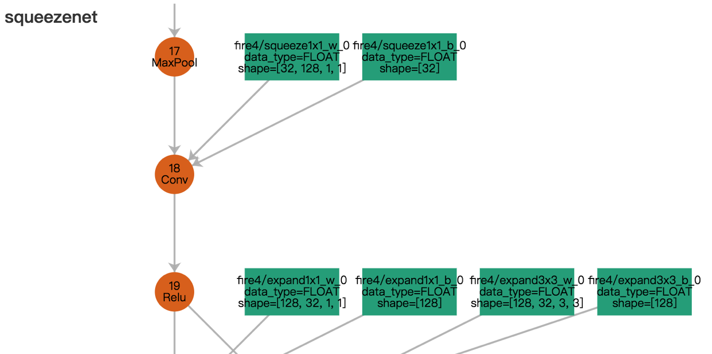
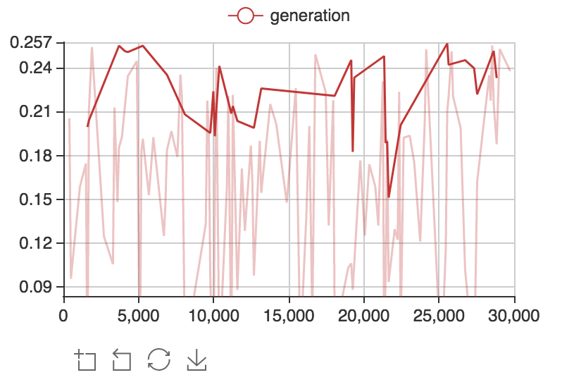
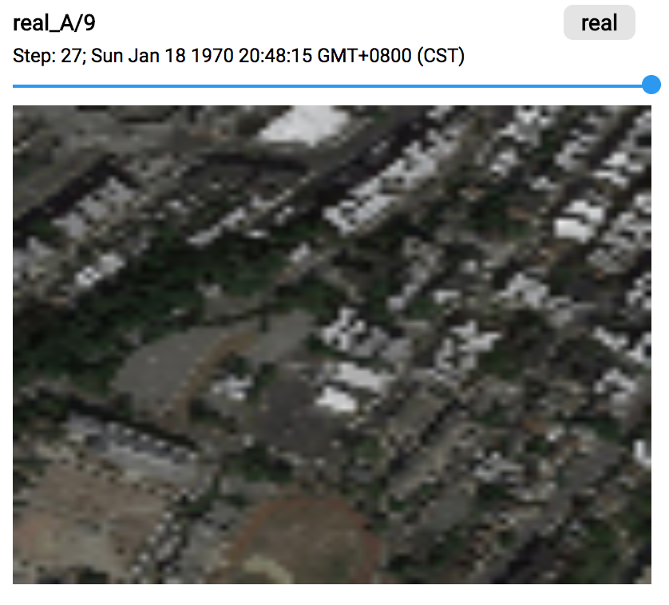
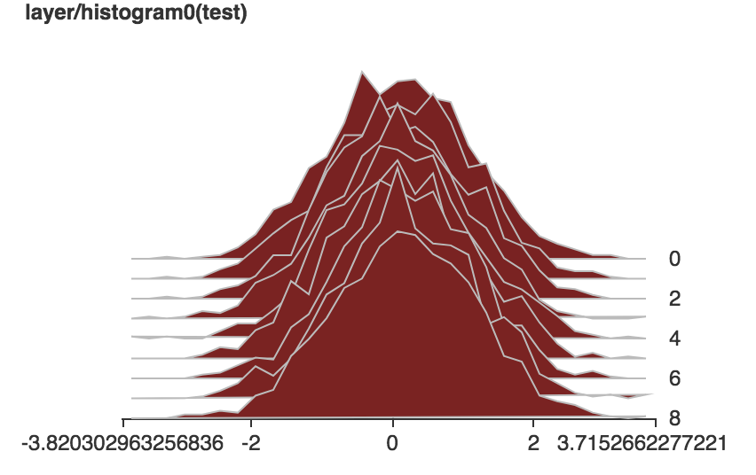

# VisualDL (Visualize the Deep Learning)

## 介绍
VisualDL是一个面向深度学习任务设计的可视化工具，包含了scalar、参数分布、模型结构、图像可视化等功能，项目正处于高速迭代中，新的优化组件会不断加入。

目前大多数DNN平台均使用Python作为配置语言，VisualDL原生支持python的使用，
通过在模型配置中添加几行配置，便可以为冷冰冰的训练过程提供丰富的可视化支持。

除了Python SDK之外，VisualDL底层采用C++编写，其暴露的C++ SDK也可以深入其他的平台中，
实现原生的性能和定制效果。

## 组件
VisualDL 目前支持4种组件：

- graph
- scalar
- image
- histogram

### graph
兼容 ONNX(Open Neural Network Exchange)[https://github.com/onnx/onnx], 通过与 python SDK的结合，VisualDL可以兼容包括 PaddlePaddle, pytorch, mxnet在内的大部分主流DNN平台。

<p align="center">

</p>

### scalar
可以用于展示训练测试的误差趋势

<p align="center">

</p>

### image
可以用于可视化任何tensor，或模型生成的图片

<p align="center">

</p>

### histogram

用于可视化任何tensor中元素分布的变化趋势

<p align="center">

</p>

## SDK
VisualDL 同时提供了python SDK 和 C++ SDK 来实现不同方式的使用。
### Python SDK
以最简单的Scalar组件为例，尝试创建一个scalar组件并插入多个时间步的数据：

```python
import random
from visualdl import LogWriter

logdir = "./tmp"
logger = LogWriter(dir, sync_cycle=10)

# mark the components with 'train' label.
with logger.mode("train"):
    # create a scalar component called 'scalars/scalar0'
    scalar0 = logger.scalar("scalars/scalar0")
    

# add some records during DL model running, lets start from another block.
with logger.mode("train"):
    # add scalars
    for step in range(100):
        scalar0.add_record(step, random.random())
```

### C++ SDK
上面 Python SDK 中代码完全一致的C++ SDK用法如下
```c++
#include <cstdlib>
#include <string>
#include "visualdl/sdk.h"

namespace vs = visualdl;
namepsace cp = visualdl::components;

int main() {
  const std::string dir = "./tmp";
  vs::LogWriter logger(dir, 10);
  
  logger.SetMode("train");
  auto tablet = logger.NewTablet("scalars/scalar0");
  
  cp::Scalar<float> scalar0(tablet);
  
  for (int step = 0; step < 1000; step++) {
    float v = (float)std::rand() / RAND_MAX;
    scalar0.AddRecord(step, v);
  }

  return 0;
}
```
## 启动Board
当训练过程中已经产生了日志数据，就可以启动board进行实时预览可视化信息

```
visualDL --logdir <some log dir>
```

board 还支持一下参数来实现远程的访问：

- `--host` 设定IP
- `--port` 设定端口
