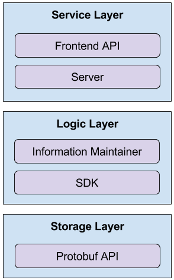

# 后端架构设计
总体上划分为3层，由上至下分别为：

- Service Layer
  - `Server` 提供服务
  - `Frontend API` 后端前端的交互接口
- Logic Layer
  - SDK, 负责为其他应用提供使用接口
    - python SDK，方便基于 python 的应用的读取
    - C SDK, 方便应用嵌入
  - Information Maintainer, 负责周期性将数据预读到内存中，方便Server直接读取
- Storage Layer
  - 负责Log 的结构化存储
  - Protobuf API, 底层的存储结构

具体架构图如下

  

以下展开一些基本的想法
## Service Layer
### server
- 基于简便的server框架实现，提供两种服务
  - 作为main程序，支持一个前端网页
  - 提供一系列的HTTP接口，以JSON格式支持与前端的交互
### Frontend API
- `Frontend API` 以单独模块的方式封装了与前端交互的接口逻辑，server依赖 `Frontend API` 与前端交互

## Logic Layer
### Information Maintainer (IM)
IM提供具体的数据处理以及计算，比如数据抽样，方差计算(histogram)等，
为了支持类似 embedding 等比较计算复杂的可视化，中间的计算结果以异步的方式更新。

IM 与 Server 的关系是

- IM 异步更新共享内存，Server 直接读取共享内存
- IM需要提供接口方便Server读取数据

### SDK
- Python SDK 用来支持任何Python界面的应用。
  - 比如 Paddle, Tensorflow 等平台能够很方便地使用 Python SDK 初步支持可视化
- C SDK 用来方便嵌入到 C/C++ 的应用中
  - 类似Paddle的平台可以通过嵌入 C 的方式实现原生可视化

## Storage Layer
### Protobuf API
- 决定了底层的数据格式，protobuf 提供了序列化的公共界面
- SDK通过Protobuf API操作底层数据

