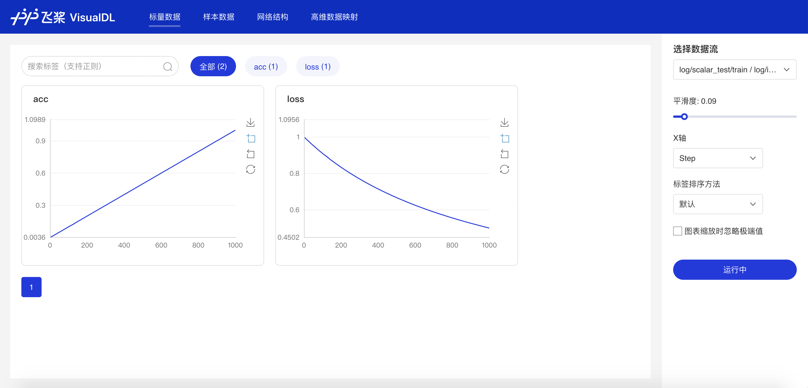
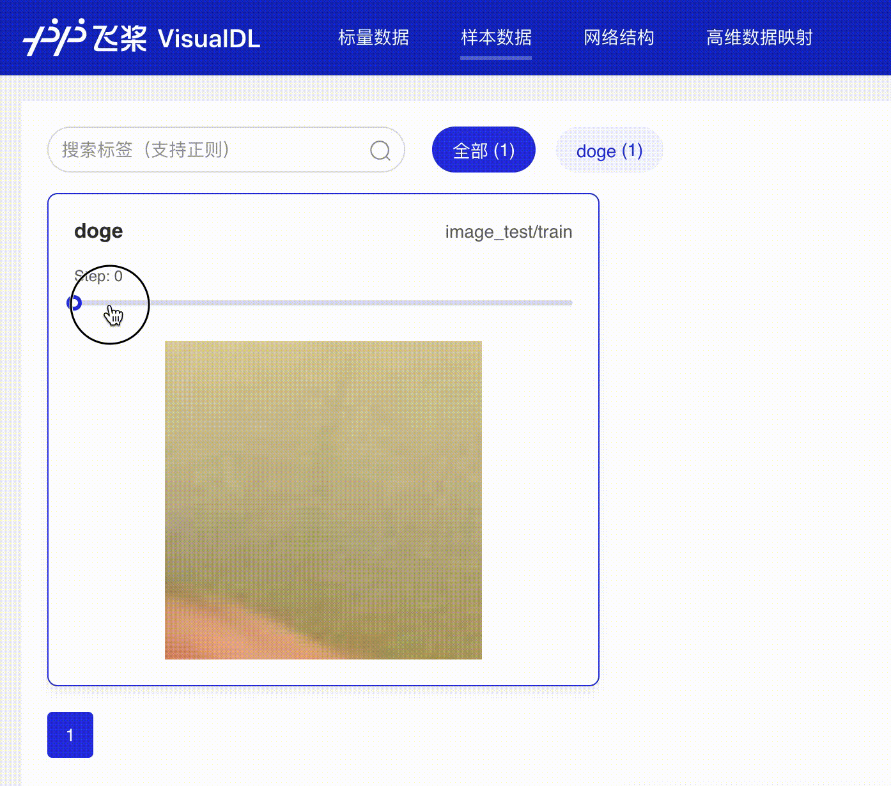
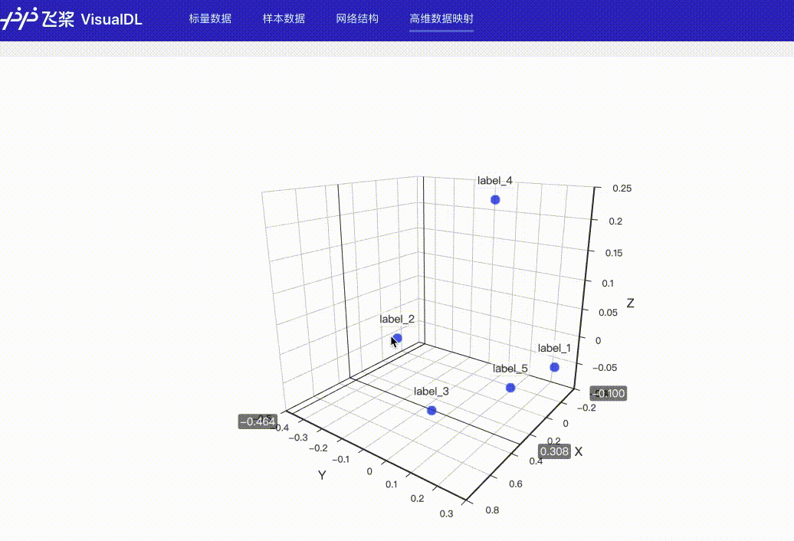

## 介绍
VisualDL拥有不同种类的组件，能够帮助开发者有效记录和监测训练中的各种指标和数据，为模型训练数据参考，及时发现错误，进而改进神经网络模型的设计

使用组件之前必须先使用LogWriter创建一个记录器，如下：
```python
from visualdl import LogWriter

with LogWriter(logdir="./log") as writer:
```
关于记录器的更多参数配置，请参考[VisualDL说明文档](../README.md)

## Scalar -- 折线图组件

### 介绍

Scalar 组件的输入数据类型为标量，该组件的作用是画折线图。将损失函数值、准确率等标量数据作为参数传入 scalar 组件，即可画出折线图，便于观察变化趋势。

### 记录接口

Scalar 组件的记录接口如下：

```python
add_scalar(tag, value, step, walltime=None)
```
接口参数说明如下：
|参数|格式|含义|
|-|-|-|
|tag|string|记录指标的标志，如`train/loss`，不能含有`%`|
|value|float|要记录的数据值|
|step|int|记录的步数|
|walltime|int|记录数据的时间戳，默认为当前时间戳|

### demo
下面展示了使用 Scalar 组件记录数据的示例，代码见[Scalar组件](../../demo/components/scalar_test.py)
```python
from visualdl import LogWriter

if __name__ == '__main__':
    value = [i/1000.0 for i in range(1000)]
    # 初始化一个记录器
    with LogWriter(logdir="./log/scalar_test/train") as writer:
        for step in range(1000):
            # 向记录器添加一个tag为`acc`的数据
            writer.add_scalar(tag="acc", step=step, value=value[step])
            # 向记录器添加一个tag为`loss`的数据
            writer.add_scalar(tag="loss", step=step, value=1/(value[step] + 1))
```
运行上述程序后，在命令行执行
```shell
visualdl --logdir ./log --port 8080
```

接着在浏览器打开`http://127.0.0.1:8080`，即可查看以下折线图。

<p align="center">
  
</p>


## Image -- 图片可视化组件

### 介绍

Image 组件用于显示图片。在程序运行过程中，将图片数据传入 Image 组件，就可在 VisualDL 的前端网页看到相应图片。

### 记录接口

Image 组件的记录接口如下：

```python
add_image(tag, img, step, walltime=None)
```
接口参数说明如下：
|参数|格式|含义|
|-|-|-|
|tag|string|记录指标的标志，如`train/loss`，不能含有`%`|
|img|numpy.ndarray|以ndarray格式表示的图片|
|step|int|记录的步数|
|walltime|int|记录数据的时间戳，默认为当前时间戳|

### demo
下面展示了使用 Image 组件记录数据的示例，代码见[Image组件](../../demo/components/image_test.py)
```python
import numpy as np
from PIL import Image
from visualdl import LogWriter


def random_crop(img):
    """获取图片的随机 100x100 分片
    """
    img = Image.open(img)
    w, h = img.size
    random_w = np.random.randint(0, w - 100)
    random_h = np.random.randint(0, h - 100)
    r = img.crop((random_w, random_h, random_w + 100, random_h + 100))
    return np.asarray(r)


if __name__ == '__main__':
    # 初始化一个记录器
    with LogWriter(logdir="./log/image_test/train") as writer:
        for step in range(6):
            # 添加一个图片数据
            writer.add_image(tag="doge",
                             img=random_crop("../../docs/images/dog.jpg"),
                             step=step)
```
运行上述程序后，在命令行执行
```shell
visualdl --logdir ./log --port 8080
```

接着在浏览器打开`http://127.0.0.1:8080`，即可拖动查看记录的不同图片。

<p align="center">
  
</p>


## High Dimensional -- 数据降维组件

### 介绍

High Dimensional 组件的作用就是将数据映射到 2D/3D 空间来做可视化嵌入，这有利于了解不同数据的相关性。High Dimensional 组件支持以下两种降维算法：

 - PCA : Principle Component Analysis 主成分分析
 - t-SNE : t-distributed stochastic neighbor embedding t-分布式随机领域嵌入

### 记录接口

High Dimensional 组件的记录接口如下：

```python
add_embeddings(tag, labels, hot_vectors, walltime=None)
```
接口参数说明如下：
|参数|格式|含义|
|-|-|-|
|tag|string|记录指标的标志，如`default`，不能含有`%`|
|labels|numpy.array 或 list|一维数组表示的标签，每个元素是一个string类型的字符串|
|hot_vectors|numpy.array or list|与labels一一对应，每个元素可以看作是某个标签的特征|
|walltime|int|记录数据的时间戳，默认为当前时间戳|

### demo
下面展示了使用 High Dimensional 组件记录数据的示例，代码见[High Dimensional组件](../../demo/components/high_dimensional_test.py)
```python
from visualdl import LogWriter


if __name__ == '__main__':
    hot_vectors = [
        [1.3561076367500755, 1.3116267195134017, 1.6785401875616097],
        [1.1039614644440658, 1.8891609992484688, 1.32030488587171],
        [1.9924524852447711, 1.9358920727142739, 1.2124401279391606],
        [1.4129542689796446, 1.7372166387197474, 1.7317806077076527],
        [1.3913371800587777, 1.4684674577930312, 1.5214136352476377]]

    labels = ["label_1", "label_2", "label_3", "label_4", "label_5"]
    # 初始化一个记录器
    with LogWriter(logdir="./log/high_dimensional_test/train") as writer:
        # 将一组labels和对应的hot_vectors传入记录器进行记录
        writer.add_embeddings(tag='default',
                              labels=labels,
                              hot_vectors=hot_vectors)
```
运行上述程序后，在命令行执行
```shell
visualdl --logdir ./log --port 8080
```

接着在浏览器打开`http://127.0.0.1:8080`，即可查看降维后的可视化数据。

<p align="center">
  
</p>
