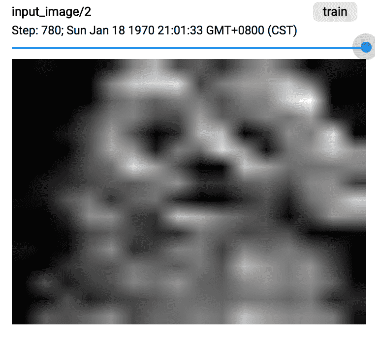

## Visual DL
`Visual DL`：让你的深度学习任务变得生动形象，可视化起来。

目前大部分深度学习框架都是基于Python语言，训练过程的状态通过日志的方式记录下来，类似下面这种：

```shell
loss:[2.532566] acc:[0.0859375] pass_acc:[0.0859375]
loss:[2.6916795] acc:[0.09375] pass_acc:[0.08984375]
loss:[2.7038598] acc:[0.1171875] pass_acc:[0.09895834]
loss:[2.6405232] acc:[0.125] pass_acc:[0.10546875]
```

这种方式可以短期看一下训练状态，但是很难从全局把握训练过程的一些变化趋势，提取的信息有限。

Visual DL 让你方便的将训练过程可视化起来，形成类似下面的图片：
<p align="center">

</p>

上述只是Visual DL诸多功能中的一项，Visual DL有以下几方面的优点。

### 功能多
1. Scalar. 支持打点数据Scalar展示，如上图所示：
	- 可以将训练过程中的loss，准确率等信息以折现的形式体现出来，方便看出整体趋势。
	- 可以在同一个图片中画出多条曲线，方便对比分析。
2. Image. 支持图片展示。
	- 输入图片展示，方便查看数据样本的质量
	- 支持卷积层的结果展示，方便查看卷积之后的效果。
<p align="center">

</p>

3. Histogram. 参数分布展示，方便查看矩阵中参数的分布曲线，以及随着训练的进行，参数分布的变化趋势。
	- 方便用户判断训练是否正常，例如参数迅速变小到0或者迅速变大，说明有梯度消失或者梯度爆炸的问题。
<p align="center">

</p>

4. Graph.  方便查看深度神经网络的模型结构。
	- 便于排查网络配置的错误
	- 帮助理解网络结构

<p align="center">

</p>

### 易集成
Visual DL提供独立的Python SDK，如果训练任务是基于Python的话，直接安装visualdl的whl包，import到自己项目中即可使用。

a. 安装visualdl包。

```shell
pip install visualdl
```
b. 在自己的Python代码中加入visualdl记日志的逻辑。

```python
import visualdl
```

### 易使用
a. 在自己的Python代码中加入visualdl记日志的逻辑。

```python
import visualdl

log_writer = LogWriter("./log", sync_cycle=30)
with log_writer.mode('train') as logger:
	loss_writer = logger.scalar("loss")

for step in steps:
	loss = train_process()
	loss_writer.add_record(step, loss)
```

b. 启动visualdl service即可通过浏览器查看日志的可视化结果。

```shell
visualDL --logdir ./log --port 8080
```
