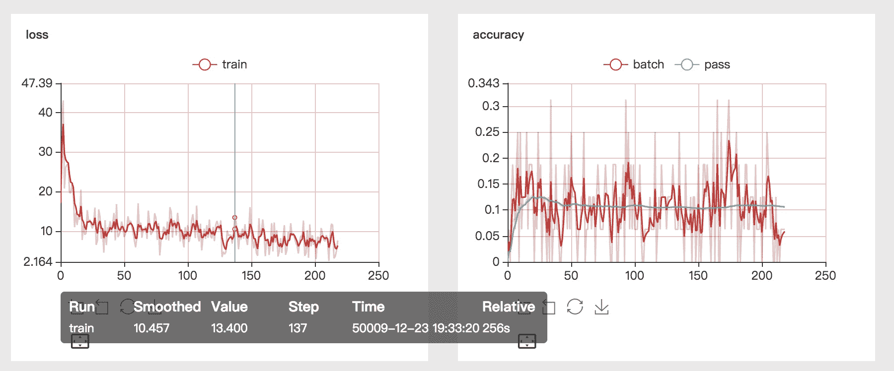
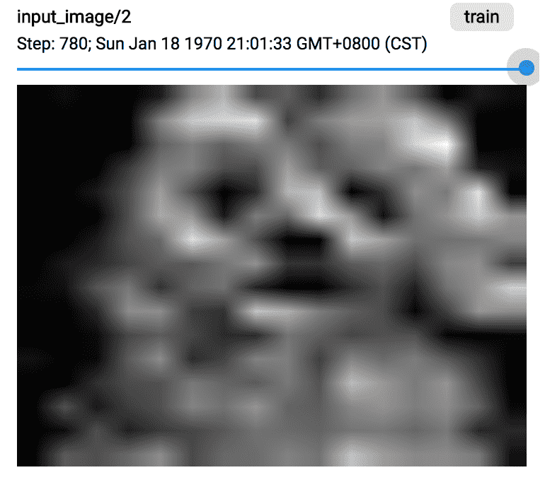
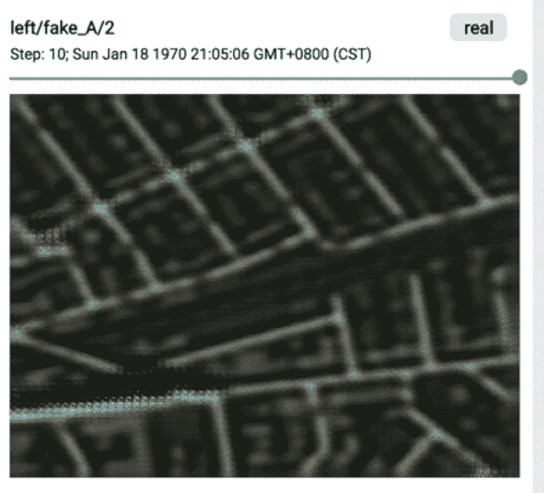
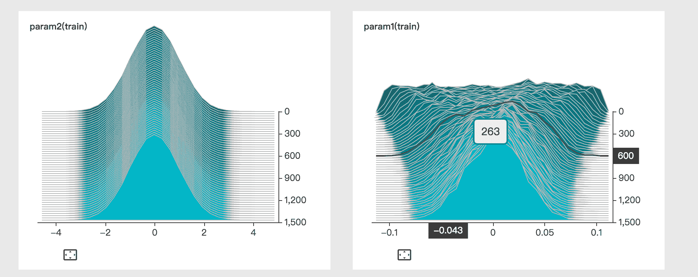
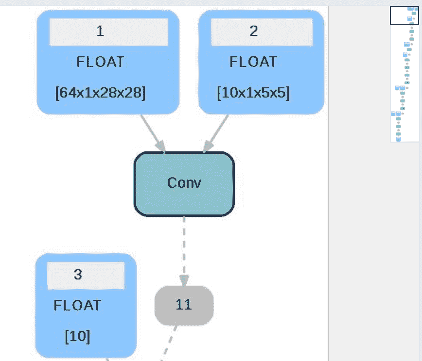

## Visual DL
`Visual DL`: makes your deep learning jobs more alive via visualization.

At present, most deep learning frameworks are using Python. The status of training process is recorded
by logs. A sample log is as follow:


```shell
loss:[2.532566] acc:[0.0859375] pass_acc:[0.0859375]
loss:[2.6916795] acc:[0.09375] pass_acc:[0.08984375]
loss:[2.7038598] acc:[0.1171875] pass_acc:[0.09895834]
loss:[2.6405232] acc:[0.125] pass_acc:[0.10546875]
```

This method can show short-term training status. But it can hardly show long-term trends.
Visual DL can help you visualize the whole training process and construct plots as below:


<p align="center">

</p>

The above is just one of Visual DL's many features. Visual DL has the following advantages:

### Comprehensive Usability

1. Scalar: support scalar line/dot data visualization, like the figure above.
    - can show metrics such as loss, accuracy, etc via lines and dots and let user see trends easily
    - can draw several curves in one figure so that it is easy to compare various metrics

2. Image: support image display.
    - display input and intermediate images, easy to check data sample
    - support display for convolutional layer, easy to see results after each layer

<p align="center">

</p>
	- support image-generating tasks to preview generated image
<p align="center">

</p>

3. Histogram: display of parameter distribution, easy to check distribution curves in each tensor,
show the trend of parameter distribution.

	- help users understand the training process and the underneath reason for the change from one parameter distribution to another
	- help users judge if the training is on the track. For example, if parameter change rate becomes close to 0 or grows rapidly,
	then exploding and vanishing gradients might happen
<p align="center">

</p>

4. Graph: visualize the model structure of deep learning networks.
    - Graph supports the preview of [ONNX](http://onnx.ai/) model. Since models of MXNet, Caffe2, PyTorch and CNTK can be converted to ONNX models easily,
    Visual DL can also support these models indirectly
    - easy to see wrong configuration of a network
    - help understand network structure


<p align="center">

</p>

### Easy to Integrate

Visual DL provides independent Python SDK. If the training task is based on Python, user can simply
use Visual DL by installing the Visual DL wheel package and importing it into her/his own project.


a. Install Visual DL package.

```shell
pip install visualdl
```
b. In your own Python code, add logic for Visual DL to collect logs.

```python
import visualdl
```

### Easy to Use
a. Add log collecting logic to your own Python code.

```python
import visualdl

log_writer = LogWriter("./log", sync_cycle=30)
with log_writer.mode('train') as logger:
	loss_writer = logger.scalar("loss")

for step in steps:
	loss = train_process()
	loss_writer.add_record(step, loss)
```

b. Launch Visual DL service and you can see the visualization results.

```shell
visualDL --logdir ./log --port 8080
```

### Purely Open Source
As a deep learning visualization tool, Visual DL support most deep learning frameworks. On the SDK perspective,
it is easy to integrate into Python and C++ projects. Through ONNX, Visual DL's Graph component can support
many popular frameworks such as PaddlePaddle, MXNet, PyTorch and  Caffe2.

Welcome everyone to comment and contribute to make Visual DL easier to use, with more features.
