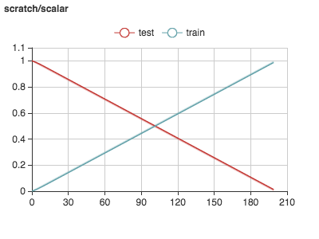

# Quick start

VisualDL is a deep learning visualization tool. It can be used to visualize intermediate and final results for training.
Currently, VisualDL supports visualization features as follows:

- Scalar: plot of trends, can be used to show error trends during training.
- Image: image visualization, can be used to show intermediate images from CNN.
- Histogram: can be used to show parameter distribution and trend.
- Graph: can be used to visualize model structure.

VisualDL provides both Python SDK and C++ SDK in nature. It can support various frameworks. 
Users can retrieve visualization data by simply adding a few lines of code using Pythong SDK. 
In addition, users can also have a deep integration by using the C++ SDK at a lower level.

## A Simple Python Demo on Scalar
For simplicity, we first try to use Python SDK.

The first step of using VisualDL is to create a `LogWriter' that can store visualization data.


```python
from VisualDL import LogWriter
from random import random

logw = LogWriter("./random_log", sync_cycle=30)
```

The first parameter points to a folder; the second parameter `sync_cycle` specifies out of how memory operations should be 
store the data into hard drive. 

There are different modes for model training, such as training, validating and testing. All these correspond to `mode' in VisualDL.
We can use the following pattern to specify mode:


```python
with logw.mode("train") as logger:
    pass
```


接着是创建一个 `Scalar` 组件，每个组件需要一个tag，tag可以是任何长度的字符串，比如 `layer/classification/error`。

```
# create scalars in mode train and test.
with logw.mode('train') as logger:
    scalar0 = logger.scalar("scratch/scalar")

with logw.mode('test') as logger:
    scalar1 = logger.scalar("scratch/scalar")

# add scalar records.
for step in range(200):
    scalar0.add_record(step, step * 1. / 200)
    scalar1.add_record(step, 1. - step * 1. / 200)
```

上述例子生成了一段随机日志，接下来可以打开board页面：

```
visualDL --logdir ./random_log --port 8080
```

之后用浏览器打开地址 `http://0.0.0.0:8080`，就可以看到scalar下的可视化结果

<p align="center">

</p>

## scalar的C++ 示例
VisualDL 的 C++ SDK 与 Python 的基本一致，上面Python示例对应的C++代码如下

```c++
  const auto dir = "./randomlog";
  LogWriter logwriter(dir, 30);
  auto logger = logwriter.AsMode("train");

  components::Scalar<float> scalar0(writer.AddTablet("scalar0"));
  components::Scalar<float> scalar1(writer.AddTablet("scalar1"));

  for (int step = 0; step < 200; step++) {
    scalar0.AddRecord(step, step * 1. / 200);
    scalar1.AddRecord(step, 1. - step * 1. / 200);
  }
```

## 基于 ONNX 的模型结构可视化
VisualDL 支持开源的 [ONNX](https://github.com/onnx/onnx)模型结构的可视化，目前ONNX支持包括 `pytorch`, `Caffe2`, `Caffe`, `MxNet` 在内的多种深度学习平台的模型结构的转化。

```
visualDL --logdir somedir --model_pb <path_to_model>
```

比如mnist，会得到如下graph

IMG
