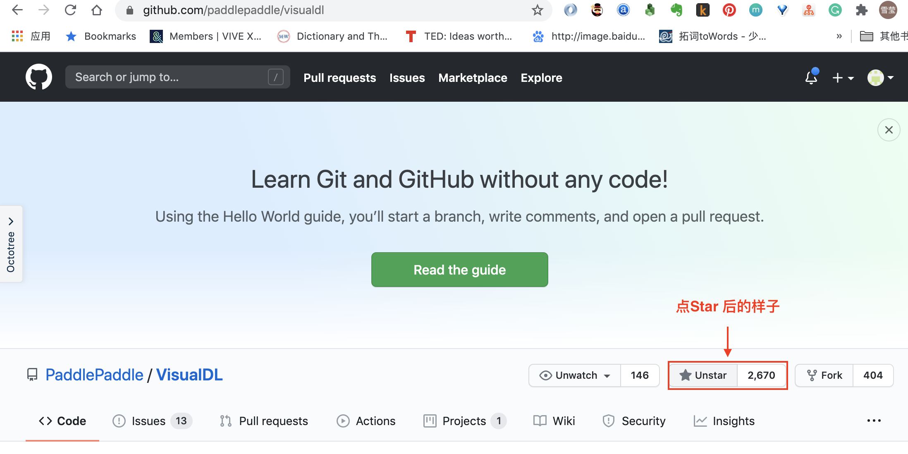
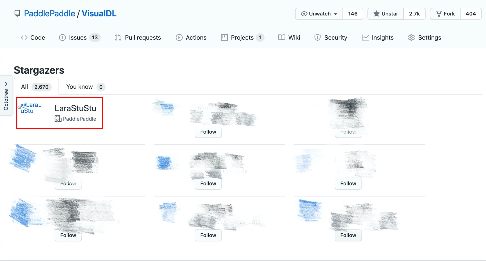

# **抽奖规则**

 

### **方式一：点Star抽奖（20名）**

•     **参与方式**：

为[VisualDL](https://github.com/PaddlePaddle/VisualDL)或者 [PaddleX](https://github.com/PaddlePaddle/PaddleX)任意Repo 点星（Star）参与抽奖（也可双重点击累加，提高中奖几率）

•     **奖项设置**：

VDL Github抽取9名，PaddleX Github抽取9名（以下奖项均分）

**一等奖（2名）** ：蓝牙键盘、飞桨充电宝

**二等奖（2名）** ：价值50元的京东购物卡

**三等奖（4名）** ：百度网盘超级会员

**鼓励奖（10名）** ：飞桨鸭舌帽/飞桨精美帆布包 任选

•     **领奖方式** ：

根据开奖公告，获奖同学凭github账号截图到**VisualDL qq群（1045783368）@Yixin|Visualdl **小姐姐领奖

### **方式二：在AI Studio上创建项目（3名）**

 

•     **参与方式**：

在AI Studio上应用PaddleX 以及 VisualDL创建「计数」项目，并将项目链接回复至AI Studio的[VDL论坛评论区](https://ai.baidu.com/forum/topic/show/960053)：飞桨团队会对项目质量打分并选择得分最高的前三名送出奖品。

•     **奖项设置**：蓝牙键盘*3

•     **领奖方式** ：依依小姐姐将单独联系获奖的项目同学送出奖品

  

### **参与时间**：

**9月21日--9月29日（下周二）**

### **开奖方式**：

**获奖名单将在9月30日公布于本页「0921直播抽奖活动」专栏**

# 获奖名单

## 一等奖

### VisualDL Repo

恭喜用户**1084667371**获得**蓝牙键盘**一个！！

### PaddleX Repo

恭喜用户**Calvert97**获得**飞桨充电宝**一个！！

## 二等奖

### VisualDL Repo

恭喜**0-yy-0**获得价值50元的**京东购物卡**！！

### PaddleX Repo

恭喜**AnkerLeng**获得价值50元的**京东购物卡**！！

## 三等奖

### VisualDL Repo

恭喜**JetHong、gylidian**获得**百度网盘超级会员**！！

### PaddleX Repo

恭喜**loyasto、liu824**获得**百度网盘超级会员**！！

## 阳光普照奖

### VisualDL Repo

恭喜**Sqhttwl、ckalong、dongtianqi1125、ralph0813、wjiawei97**获得**飞桨鸭舌帽 OR 飞桨帆布袋**！！

### PaddleX Repo

恭喜**wangluohaima、Yaoxingtian、rango42z、qiceng、mumucai**获得**飞桨鸭舌帽 OR 飞桨帆布袋**！！

*注意：阳光普照奖获奖小伙伴们先领奖可以先选择心仪的奖品（飞桨鸭舌帽 OR 飞桨帆布袋）噢~~

## 领奖方式

**再次恭喜以上获奖小伙伴们，请加入VisualDL官方QQ群1045783368，在群里@依依小姐姐（Yixin|VisualDL）发送Github账号截图领奖~~**

 

